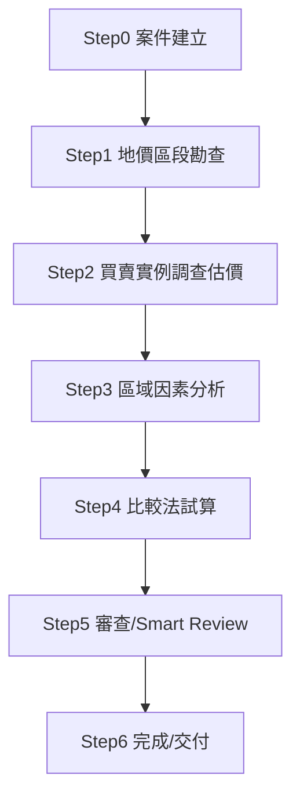

# Phase 2 — Business Process（正式查估流程）

> 依 Phase 1 GO 判定，本文件重新查閱查估書表範本.pdf、評價基準明細表範例.pdf、
> 土地徵收補償市價查估作業手冊.pdf 與 8/26 工作坊資料後整理。凡標示【待確認】者，
> 沿用 Phase 1 `open_questions.md` 之結論，本階段不自行補齊為業務規則。

## 流程總覽

本流程聚焦本次競賽核心之表1／表5-2／表4三張表；表7以後之書表（徵收土地宗地市價
估計表等）依 Phase 1 `open_questions.md` D-5 假設不在本次範圍內。

---

## Step 0 — 案件建立

| 項目 | 內容 |
|---|---|
| Step | 案件建立（Case Initialization） |
| Input | 決賽提供之區段編號、區段範圍（已預填）；官方指定之評價基準明細表（區域＋個別） |
| Activity | 建立案件識別資料（案號、年期、區段編號、區段範圍、行政區） |
| Form | 表1（頁首欄位）、表5-2（頁首）、表4（頁首） |
| Output | Case識別資料結構（`appraisal_period`, `segment_code`, `segment_scope`, `district`, `case_no`） |
| Manual / Automatable | Automatable（欄位直接複製官方已預填內容，無需判斷） |
| Source | 逐字稿 [00:25:22-00:26:32]（決賽當日區段編號/範圍已預填）；查估書表範本表1/5-2/4頁首 |

---

## Step 1 — 地價區段勘查（表1填寫）

| 項目 | 內容 |
|---|---|
| Step | 地價區段勘查（Regional Survey） |
| Input | 案件識別資料（Step0）；政府公開資料／Mock資料／GIS資料源（土地使用管制、交通運輸、自然條件、公共建設等） |
| Activity | 逐項調查並填載表1各主要項目（土地使用管制、交通運輸、自然條件、土地改良、公共建設、電業氣體燃料、特殊設施、廢棄物處理、環境污染、工商活動、其他影響因素） |
| Form | 表1 地價區段勘查表（全表） |
| Output | 表1完整欄位資料（見 `schemas/field_dictionary.json` 表1區段，133個欄位） |
| Manual / Automatable | 部分Automatable（設施名稱/距離可由Data Acquisition Layer+GIS Distance Engine取得；質性描述欄位如「日照」「景觀」等Golden Case本身留空，實務上可能仍需人工現場勘查，屬【待確認：這類欄位是否為AI可完全自動化項目，或本質上需人工現場勘查】） |
| Source | 作業手冊「參、三、劃分或修正地價區段」；查估書表範本表1；命題文件（區域因素背景說明） |

**業務手冊原文依據**：劃分地價區段時，「應攜帶地籍圖及地價區段勘查表實地勘查」，
斟酌地價之差異、土地使用管制、交通運輸、自然條件、土地改良、公共建設、特殊設施、
環境污染、工商活動、房屋建築現況、土地利用現況及其他影響地價因素。此為 Step 1
之官方業務基礎（作業手冊「參、三、(一)」）。

---

## Step 2 — 買賣實例調查估價（表4「0基本資料」來源）

| 項目 | 內容 |
|---|---|
| Step | 買賣實例調查估價（Comparable Sales Investigation） |
| Input | 比較標的（買賣實例）之地址、交易日期、成交總價、面積等基本資料 |
| Activity | 估計比較標的之土地正常單價；蒐集案例期間依估價基準日前後6個月為原則，特殊情形可放寬至前一年（Golden Case備註欄即為此情形之範例） |
| Form | 買賣實例調查估價表（本次競賽範圍外之書表，僅其估算結果「土地正常單價」流入表4） |
| Output | `land_normal_price_n`（表4欄位，如184,763元/M²） |
| Manual / Automatable | 非本次競賽核心範圍；若延伸應用，土地正常單價估算屬估價師專業判斷（非deterministic規則），AI僅可輔助整理資料 |
| Source | 作業手冊「參、四、估計實例土地正常單價」；作業手冊「伍、三、買賣實例調查估價表」（p.34起，本階段未深入展開，因非本次三張核心表之一） |

**重要限制**：買賣實例調查估價表本身不在 REQ-004 所列「一定要看到的基本」三張表
之內，本文件僅記錄其輸出（土地正常單價）如何流入表4，不展開其完整填表規則。

---

## Step 3 — 區域因素分析（表5-2填寫）

| 項目 | 內容 |
|---|---|
| Step | 影響地價區域因素分析（Regional Factor Analysis） |
| Input | 表1調查結果（Step1）；區域因素評價基準明細表（官方於決賽提供，對應當次區段/用地類別） |
| Activity | 將表1調查所得之區域因素原始資料（如主要道路寬度18M），依評價基準明細表之級距判定優劣等級（如「普通」），再查表得修正百分比；分別針對比準地區段與各比較標的區段進行，並計算各主要項目百分比小計、影響地價區域因素總修正數 |
| Form | 表5-2 影響地價區域因素分析明細表 |
| Output | 27項區域因素之優劣等級與修正百分比、8項主要項目百分比小計、`regional_total_adjustment` |
| Manual / Automatable | Automatable（Rule Engine依基準明細表deterministic判定，禁止LLM自行判定優劣等級或修正率，見 REQ-023/評分規則） |
| Source | 作業手冊「伍、五、影響地價區域因素分析明細表」（p.41-49）；評價基準明細表範例（區域因素6頁）；逐字稿 [00:14:22-00:14:42]（官方口頭確認須依基準明細表判定等級與修正率） |

**關鍵業務規則**（作業手冊 p.47-48原文）：
1. 優劣等級：表5-2內所填載之比準地／各比較標的區段之優劣等級，應與表1所調查之
   基本資料及優劣等級相符（即 Step1→Step3 之 Dependency，見 `form_dependency.md`）。
2. 修正百分比：依優劣等級對應基準明細表所訂級距差異修正百分比填載；如有特殊情況，
   得於備註欄敘明理由後酌予調整，但不得超出內政部訂定之最大影響範圍（Phase 1
   `evidence_matrix.md` REQ-025）。
3. 影響地價區域因素總修正數：各主要項目小計相加後得出，須帶入表4之「區域因素
   調整」欄（即 Step3→Step4 之 Dependency）。

**Golden Case 觀察**（本輪新發現，供 Phase 3 驗證使用）：Golden Case 中比準地與
比較標的1同屬地價區段 P002-00，故27項區域因素之優劣等級全數相同、修正百分比
全數為0.00%，`regional_total_adjustment`=0.00%。此為「同區段比較」之特例，非
一般情形；若決賽案例之比準地與比較標的分屬不同地價區段，修正百分比預期將出現
非零值，Rule Engine 須支援此一般情形，不可僅依 Golden Case 之零值特例設計。

---

## Step 4 — 比較法試算（表4填寫）

| 項目 | 內容 |
|---|---|
| Step | 比較法試算（Sales Comparison Trial Calculation） |
| Input | 比較標的土地正常單價（Step2）；表5-2區域因素總修正數（Step3）；個別因素評價基準明細表；比準地與比較標的之個別條件資料（面積、寬度、道路條件等） |
| Activity | ①價格日期調整：依地價指數等資料計算調整百分率，得調整至估價基準日單價；②區域因素調整：直接承接表5-2總修正數；③個別因素調整：逐項比較比準地與比較標的之個別條件，依個別因素評價基準明細表判定差異率，加總得個別因素調整合計；④計算調整百分率絕對值加總，決定價格形成因素相近程度與比較標的權重；⑤加權平均得比準地比較價格 |
| Form | 表4 比較法調查估價表 |
| Output | `base_parcel_comparison_price`（比準地比較價格，如212,958元/M²）及全部中間計算欄位 |
| Manual / Automatable | 部分Automatable：Grade/Adjustment判定與加總計算屬deterministic（Automatable）；價格日期調整率、價格形成因素相近程度屬估價師專業判斷（AI輔助建議＋人工核定） |
| Source | 作業手冊「伍、六、比較法調查估價表」（p.50-53）；查估書表範本表4；逐字稿 [00:22:26-00:22:49]（審查人員需核對距離、級距、修正率、加總結果） |

**精度規則（Phase 2 新驗證，見 `calculation_dependency.md` 完整推導）**：本階段
重新以Golden Case數值獨立驗算，確認唯有「調整至估價基準日單價」全程保留未四捨
五入之完整精度（188,458.26，而非表單顯示之188,459），代入後續個別/區域因素調整
（×1.13）並於最終步驟四捨五入，方能得出與官方表單一致之212,958；若使用表單顯示
之已四捨五入中間值計算，將得212,959（誤差1單位）。此驗證了 Calculation Engine
「全程保留完整精度、僅於最終輸出四捨五入」之設計原則具有可驗證的官方數據支持。

---

## Step 5 — 審查／Smart Review（官方既有SOP，本次競賽鼓勵延伸應用）

| 項目 | 內容 |
|---|---|
| Step | 審查（Review） |
| Input | 已填寫完成之表1、表5-2、表4 |
| Activity | 依作業手冊既有審查checklist：確認優劣等級依基準明細表填列；確認表5-2優劣等級與表1一致；確認表4區域因素調整百分率與表5-2總修正數相符；確認個別因素差異率依基準明細表填列；確認比較標的權重合理 |
| Form | 跨表比對（表1↔表5-2↔表4），非獨立表單 |
| Output | Audit Issue清單（Passed/Error/Warning/Missing/Inconsistent/Low Confidence，依主專案指示格式） |
| Manual / Automatable | Automatable（此為官方既有制度化審查SOP，天然適合規則化；但依 Phase 1 evaluation_focus.md，此屬「鼓勵延伸應用」，非本次「一定要看到的基本」） |
| Source | 作業手冊「柒、七、審查重點」（p.10-12）；逐字稿 [00:16:38-00:17:02]（官方鼓勵AI輔助智慧檢核） |

---

## Step 6 — 完成／交付

| 項目 | 內容 |
|---|---|
| Step | 完成／交付（Completion & Delivery） |
| Input | 通過審查（或標記待人工複核）之表1、表5-2、表4 |
| Activity | 產出填寫完成之PDF書表；提供Live Demo；錄製操作流程影片 |
| Form | 表1、表5-2、表4（PDF輸出） |
| Output | 填寫完成之PDF×3；Live Demo連結；操作影片 |
| Manual / Automatable | 依 Phase 1 `evaluation_focus.md`，全自動化產出PDF評分較優；半自動化（Excel人工填寫）為可接受之備援路徑 |
| Source | 逐字稿 [00:18:46-00:19:23]（PDF輸出流程）；[00:20:30-00:21:23]（Live Demo與影片要求） |

---

## 待確認事項（承接 Phase 1，本階段未新增假設）

- Step1中偏質性欄位（日照、景觀、傾斜度、風勢、土質等）在Golden Case中留空，
  決賽當次是否仍留空或需要填寫，Sources無法確認，沿用 Phase 1 `open_questions.md`
  處理原則（不可猜測，回傳UNKNOWN/MANUAL_REVIEW_REQUIRED）。
- Step4之「調整至估價基準日單價」中間欄位進位規則缺口（Phase 1 open_questions.md
  B-4），本階段之驗算結果已作為佐證收錄於 `calculation_dependency.md`，但規則本身
  仍待官方確認，不視為本階段已解決。
