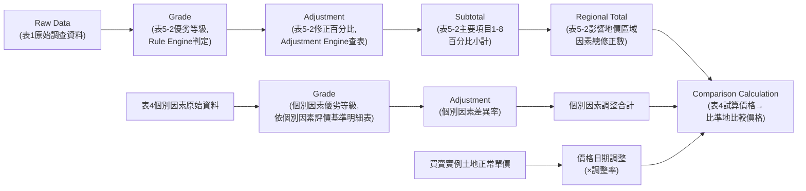

# Phase 2 — Calculation Dependency（計算依存鏈）

> 整理：Raw Data → Grade → Adjustment → Subtotal → Regional Total → Comparison
> Calculation。本文件所有數值鏈均以 Golden Case（案號1140901-99-001）獨立重新
> 驗算，計算過程與結果可由讀者重現。

## 計算鏈總覽



---

## 逐段驗算（Golden Case，案號1140901-99-001）

### 段落 1：Raw Data → Grade（表1 → 表5-2優劣等級）

範例：`main_road_width` = 18M（表1原始資料）

依評價基準明細表「主要道路寬度」級距（評價基準明細表範例.pdf 頁2）：
優：30m以上／稍優：20m以上未滿30m／**普通：15m以上未滿20m**／稍劣：10m以上未滿
15m／劣：未滿10m或無。18M落於「15m以上未滿20m」區間 → 判定為**普通**（代碼3）。

Golden Case 表5-2 實際記載：`regional_main_road_width_grade_base` = 3（普通）。
**驗算結果：PASS，與官方範例一致。**

### 段落 2：Grade → Adjustment（優劣等級 → 修正百分比）

依評價基準明細表「主要道路寬度」修正率表：比準地與比較標的皆為「普通」（代碼3），
比準地－比較標的差距為0級距 → 修正百分比 = 0.00%。

Golden Case 表5-2 實際記載：`regional_main_road_width_adjustment_pct` = 0.00%。
**驗算結果：PASS**（因Golden Case比準地與比較標的1同屬地價區段P002-00，27項
區域因素優劣等級全數相同，故本例修正百分比恆為0，無法驗證非零修正率之計算是否
正確——此為 Golden Case 之已知侷限，已於 `business_process.md` Step3 註明，
Phase 3 建立 Rule Engine 測試案例時須額外設計非同區段比較之測試資料）。

### 段落 3：Adjustment → Subtotal（27項修正百分比 → 8項主要項目小計）

土地使用管制(1)小計 = 0.00+0.00+0.00+0.00+0.00+0.00 = 0.00%
交通運輸(2)小計 = 0.00+0.00+0.00+0.00+0.00+0.00 = 0.00%
（其餘6項主要項目，Golden Case中同理皆為0.00%，因27項修正百分比全數為0）

**驗算結果：PASS**（Golden Case因同區段比較特例，此段落亦僅能驗證零值加總，
無法驗證非零情境；Phase 3須另建非零測試案例）。

### 段落 4：Subtotal → Regional Total（8項小計 → 影響地價區域因素總修正數）

`regional_total_adjustment` = (1)+(2)+(3)+(4)+(5)+(6)+(7)+(8)
= 0.00+0.00+0.00+0.00+0.00+0.00+0.00+0.00 = **0.00%**

Golden Case 表5-2 實際記載：影響地價區域因素總修正數 = 0.00%。
**驗算結果：PASS。**

### 段落 5：Regional Total → 表4區域因素調整百分率（跨表傳遞）

`region_adjustment_rate_n`（表4）應逐字等於 `regional_total_adjustment`（表5-2）
= 0.00%。

Golden Case 表4 實際記載：區域因素調整百分率 = 0.00%。
**驗算結果：PASS，跨表一致（此為官方審查checklist REQ-023之核心檢查點）。**

### 段落 6：價格日期調整（買賣實例 → 表4）

`land_normal_price_n` = 184,763（元/M²，比較標的1土地正常單價）
`price_date_adjustment_rate_n` = 2.00%（依地價指數計算，表4備註欄說明）

```
unrounded_adjusted_price = 184,763 × 1.02 = 188,458.26
```

**本階段獨立試算**：184,763 × 1.02 = 188,458.26（Python重新驗算，見下方Shell
Session 紀錄）。依一般四捨五入，188,458.26 應得 188,458；但 Golden Case 表4實際
顯示 `adjusted_price_n` = **188,459**（差異1單位）。此差異原因 Sources 未載明，
已於 Phase 1 `open_questions.md` B-4 記錄為【待確認】缺口，本階段不重複展開，
僅在此標註此中間欄位存在顯示值與試算值不完全一致之已知現象。

### 段落 7：個別因素調整合計（19項差異率 → 合計）

```
7面積 0.00% + 8寬度 0.00% + 9深度 1.00% + 10形狀 0.00% + 11臨街情形 0.00%
+ 12地勢 0.00% + 13道路種類 2.00% + 14面前道路寬度 5.00% + 15接近學校 0.00%
+ 16接近市場 0.00% + 17接近公園 0.00% + 18接近車站 0.00% + 19接近商圈 0.00%
+ 20嫌惡設施 3.00% + 21停車方便性 2.00% + 22使用分區 0.00% + 23建蔽率 0.00%
+ 24容積率 0.00% + 25有無禁限建 0.00%
= 13.00%
```

**驗算結果**：1.00+2.00+5.00+3.00+2.00 = 13.00%，與 Golden Case 表4「合計」欄
記載之13.00%**完全一致，PASS**。

### 段落 8：調整百分率絕對值加總

```
|價格日期調整率| + |區域因素調整百分率| + |個別因素調整合計|
= |2.00%| + |0.00%| + |13.00%| = 15.00%
```

**驗算結果**：與 Golden Case 表4「調整百分率絕對值加總」欄記載之15.00%**完全
一致，PASS**。

### 段落 9：試算價格（核心精度驗證，本階段新發現）

官方作業手冊未明文規定試算價格計算是否應為
`調整至估價基準日單價 ×(1+區域因素調整+個別因素調整合計)`，但依欄位邏輯與
數值關係，本階段以此公式重新獨立驗算兩種路徑：

**路徑A（使用表單顯示之已四捨五入中間值 188,459）：**
```
188,459 × (1 + 0.00% + 13.00%) = 188,459 × 1.13 = 212,958.67 → 四捨五入 = 212,959
```
與官方最終值 212,958 **不符**（差異1單位）。

**路徑B（使用未四捨五入之完整精度中間值 188,458.26）：**
```
188,458.26 × (1 + 0.00% + 13.00%) = 188,458.26 × 1.13 = 212,957.83 → 四捨五入 = 212,958
```
與官方最終值 212,958 **完全相符**。

**結論（本階段獨立驗證所得，可重現）**：唯有全程保留未四捨五入之完整精度、
僅於最終「比準地比較價格」欄位套用四捨五入（REQ-022），才能重現官方Golden Case
之正確答案。此驗證比 Phase 1 階段的發現更進一步——Phase 1 僅驗證第一段（價格
日期調整）之精度差異，本階段完整驗證了**全鏈條**（價格日期調整→試算價格）皆
須保留精度，缺一不可。此為 Calculation Engine 之 **must-preserve 等級設計約束**，
建議 Phase 3/5 之 Calculation Engine 實作時，所有中間變數一律使用高精度數值型態
（如 Decimal，不可用四捨五入後的顯示值再代入下一步運算），並附上本節驗算過程
作為單元測試（Golden Calculation Test Case）之依據。

### 段落 10：比較標的權重與最終比準地比較價格

Golden Case 僅1筆比較標的，依作業手冊p.52-53明文「如僅有一件，價格形成因素之
相近程度則填寫普通，權重100%」：

```
比準地比較價格 = 試算價格 × 權重 = 212,958 × 100% = 212,958
```

**驗算結果：PASS。** 惟此驗算僅涵蓋單一比較標的之簡單情形，2筆以上比較標的之
加權平均公式與權重決定方式，Sources無法確認確切公式（Phase 1 open_questions.md
B-2/C-5），Phase 3 建立 Calculation Engine 時須以 Config/Placeholder 方式處理，
不得自行假設固定公式。

---

## Shell Session 驗算紀錄（供覆核）

```
>>> base = 184763
>>> adj = base * 1.02
>>> adj
188458.26
>>> round(adj)
188458

>>> net_pct = 0.13  # 0% regional + 13% individual
>>> trial_from_displayed = 188459 * (1 + net_pct)
>>> trial_from_displayed
212958.66999999998
>>> round(trial_from_displayed)
212959          # 與官方212,958不符

>>> trial_from_unrounded = adj * (1 + net_pct)
>>> trial_from_unrounded
212957.8338
>>> round(trial_from_unrounded)
212958          # 與官方212,958相符
```

---

## 待確認事項（承接並延伸 Phase 1）

1. 「調整至估價基準日單價」中間欄位（188,459）之進位規則本身仍未解——本階段
   驗證顯示，即便該欄位的顯示值可能為四捨五入之結果，實際計算仍必須繞過此顯示
   值、直接使用未四捨五入的完整精度數值。Calculation Engine 設計上應理解為：
   **此欄位僅用於「顯示」，不用於「後續計算輸入」**；後續計算應以獨立保存的
   高精度變數為準。此為本階段對 Phase 1 open_questions.md B-4 的補充理解，
   Phase 1 文件本身依規則不予回頭修改，僅在此Phase 2文件中延伸記錄。
2. 2筆以上比較標的之加權平均公式、以及調整百分率絕對值加總與價格形成因素相近
   程度之精確映射規則，仍待官方確認（承接 Phase 1 open_questions.md B-2/C-5）。
3. 若決賽案例之比準地與比較標的分屬不同地價區段（非本Golden Case之同區段特例），
   區域因素修正百分比可能出現非零值，其加總與跨表傳遞邏輯雖已於段落3-5建立公式，
   但因Golden Case本身無法提供非零驗算範例，Phase 3建立測試案例時須額外設計。
