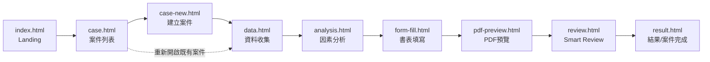

# Phase 4 — Frontend Route Plan（前端頁面路由規劃）

> 依主專案指示「本階段只規劃，不要大量建立App Pages」，本文件**僅規劃**9個頁面
> 之定位、資料需求與頁面流程，**不建立任何新HTML檔案**。實際建立於Phase 7
> 「Existing Frontend Integration」。

## 頁面流程總覽

---

## 頁面規劃明細

### index.html（已存在，Landing Page）
- **定位**：產品介紹頁，非操作頁面。
- **現況**：已客製化（見frontend_inventory.md）。
- **後續調整**（Phase 7範圍，本階段僅記錄）：導覽列錨點需改為指向`case.html`
  等真實頁面，而非僅頁內錨點捲動。

### case.html（規劃中）
- **定位**：案件列表，對應主專案指示API `GET /api/cases`。
- **資料需求**：案件清單（案號、區段、狀態、最後更新時間）。
- **頁面狀態**：LOADING / SUCCESS / EMPTY（無案件時） / ERROR。
- **主要互動**：點擊案件進入`data.html`或`result.html`（依案件完成度導向）；
  「建立新案件」按鈕導向`case-new.html`。

### case-new.html（規劃中）
- **定位**：建立案件，對應API `POST /api/cases`。
- **資料需求**：案號、區段編號、區段範圍（決賽當日通常已預填，見Phase 1
  official_requirements.md第9節）、行政區、用地類別。
- **表單驗證**：`domain.models.CompetitionCase`之必要欄位（見`domain/models.py`）
  即為此頁表單驗證規則之後端對應依據，前端驗證邏輯應與其一致但**不得複製業務
  規則到前端**（依主專案指示第21節，Frontend僅負責Presentation/Interaction/
  API Request/Result Visualization）。

### data.html（規劃中）
- **定位**：資料收集，對應API `POST /api/cases/{id}/collect-data`。
- **資料需求**：表1地價區段勘查表之全部欄位（見`schemas/field_dictionary.json`
  表1區段133個欄位）；比準地與比較標的之個別因素原始資料。
- **頁面狀態**：需支援欄位逐項之`COMPLETED`/`MANUAL_REVIEW_REQUIRED`/`UNKNOWN`
  三態顯示（對應`domain.models.FieldStatus`）。

### analysis.html（規劃中）
- **定位**：因素分析結果展示，對應API `POST /api/cases/{id}/analyze`。
- **資料需求**：`FormCompletionResult`中所有Grade/Adjustment相關`FieldCompletion`
  （見`engine/form_completion_engine.py`輸出）；每個因素之grade、adjustment、
  rule_id應可展開查看（呼應TRACEABILITY需求）。
- **重要UI原則**：Grade/Adjustment數值為Rule Engine/Adjustment Engine之
  deterministic輸出，前端應標示為「唯讀」，不應提供可任意覆寫優劣等級之UI元件
  （避免使用者或未來維護者誤解為可自由編輯的一般欄位）。

### form-fill.html（規劃中）
- **定位**：書表填寫總覽，對應API `POST /api/cases/{id}/complete-form`。
- **資料需求**：`FormCompletionResult.fields`全部內容，依`form`欄位分頁籤顯示
  （表1/表5-2/表4三個籤）。
- **人工介入點**：`price_formation_similarity`、`comparable_weight`（多筆比較
  標的時）等`MANUAL_REVIEW_REQUIRED`欄位，此頁應提供明確的人工輸入介面，並清楚
  標示「此欄位非規則自動判定，需估價師專業判斷」（呼應`engine/form_completion_engine.py`
  之欄位警告文字）。

### pdf-preview.html（規劃中）
- **定位**：PDF預覽，對應API `GET /api/cases/{id}/pdf`。
- **資料需求**：後端產出之PDF二進位內容或下載連結；此頁面本身不涉及PDF生成
  邏輯（該邏輯屬Phase 5 PDF Engine範圍）。

### review.html（規劃中）
- **定位**：Smart Review結果，對應API `POST /api/cases/{id}/review`。
- **資料需求**：AuditIssue清單（Passed/Error/Warning/Missing/Inconsistent/
  Low Confidence，依主專案指示第17節格式）。
- **重要**：本階段（Phase 4）之`FormCompletionEngine`尚未包含Cross-form
  Validation邏輯（屬Phase 6範圍），此頁面之後端資料來源要等Phase 6完成後才會
  有真實內容，Phase 4/7暫以Mock資料規劃版面。

### result.html（規劃中）
- **定位**：案件完成總覽，對應API `GET /api/cases/{id}/result`。
- **資料需求**：案件最終狀態、填寫完成之PDF連結、Smart Review摘要統計。

---

## 資料流與現有Domain Model對應

| 頁面 | 主要對應Domain Model / Engine輸出 |
|---|---|
| case-new.html | `domain.models.CompetitionCase` |
| data.html | `domain.models.FactorInput` + `Evidence` |
| analysis.html | `domain.models.GradeResult` + `AdjustmentResult` |
| form-fill.html | `domain.models.FieldCompletion` + `FormCompletionResult` |
| review.html | （Phase 6產出之AuditIssue，本階段尚未定義） |

---

## 本階段未做事項（刻意排除）

- 未建立上述任何HTML檔案本身。
- 未修改`index.html`之導覽列連結。
- 未定義AuditIssue之Pydantic Model（屬Phase 6 Smart Review範圍）。
- 未實作任何頁面之CSS/JS。
