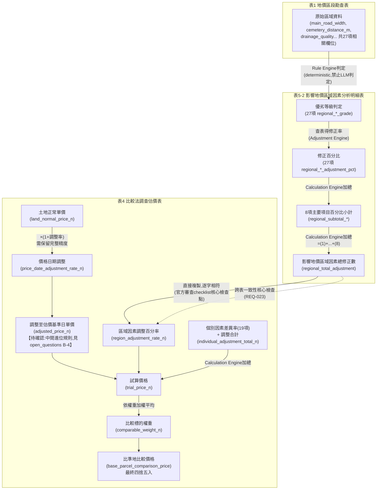

> 來源撤回：本文件使用的會議錄影、逐字稿及視覺時間軸已移除。相關推論尚未重新以正式書面資料驗證，不可再視為官方依據。

# Phase 2 — Form Dependency（表單依存關係）

> 依主專案指示第13-14節（Cross-Form Engine / Dependency Impact Analysis）要求，
> 本文件建立表1→表5-2→表4之明確 Dependency，並標示每個 Dependency 之
> `impact_if_wrong`（上游錯誤時之下游影響）。

## 官方依據

地政局代表於8/26工作坊親自提醒（逐字稿 [00:45:01-00:45:56]）：「這三張表單有
互聯性...地價區段勘查表接著就是那張區域因素分析明細表，那區域因素分析明細表的
資料其實就是來自於你前面的區勘表的這個概念，其實他有一個聯動...區域因素分析
明細表的資料，表的一個總加總的一個部分，總加總的修正率，它也會在比較法調查表
裡面去出現，所以如果你有一個地方出錯，你可能其實是會有一個聯動錯誤的這樣的一個
問題。」（Phase 1 evidence_matrix.md REQ-011）

此官方口頭提醒與作業手冊既有審查checklist（p.10-12, REQ-023）完全一致，二者
互相印證，非單一來源之孤證。

---

## Dependency 總表

| upstream_form | upstream_field | transformation | downstream_form | downstream_field | impact_if_wrong |
|---|---|---|---|---|---|
| 表1 | main_road_width | Rule Engine依區域因素評價基準明細表判定優劣等級 | 表5-2 | regional_main_road_width_grade_base | 若表1寬度數值錯誤→表5-2等級誤判→修正百分比誤算→區域因素總修正數錯誤→表4區域因素調整百分率錯誤→試算價格與比準地比較價格全數錯誤（**全鏈條擴散**） |
| 表1 | segment_avg_road_width | 同上 | 表5-2 | regional_avg_road_width_grade_base | 同上（全鏈條擴散） |
| 表1 | building_coverage_ratio | 同上 | 表5-2 | regional_building_coverage_ratio_grade_base | 同上（全鏈條擴散） |
| 表1 | floor_area_ratio | 同上 | 表5-2 | regional_floor_area_ratio_grade_base | 同上（全鏈條擴散） |
| 表1 | cemetery_distance_m（等27項區域因素原始資料，見form_mapping.md完整列表） | Rule Engine判定優劣等級 | 表5-2 | 對應之 `regional_*_grade_base` | 單一因素錯誤僅影響該因素所屬主要項目之百分比小計，若小計錯誤則影響總修正數（**局部擴散，範圍限於同一主要項目1-8類別內**） |
| 表5-2 | regional_*_adjustment_pct（27項） | Calculation Engine加總 | 表5-2 | regional_subtotal_<category>（8個主要項目小計） | 任一項修正百分比錯誤→所屬主要項目小計錯誤→影響總修正數（**局部→中游擴散**） |
| 表5-2 | regional_subtotal_<category>（8項） | Calculation Engine加總 =(1)+...+(8) | 表5-2 | regional_total_adjustment | 任一小計錯誤→總修正數錯誤（**中游擴散**） |
| 表5-2 | regional_total_adjustment | 直接複製（逐字相符，非重新計算） | 表4 | region_adjustment_rate_n | 若表5-2總修正數與表4區域因素調整百分率不一致→官方審查checklist明確會抓出此不一致（作業手冊p.48「(4)」／REQ-023）→視為Cross-form Inconsistent Error（**跨表核心一致性錯誤**） |
| 表4 | land_normal_price_n | Calculation Engine：×(1+price_date_adjustment_rate_n) | 表4 | adjusted_price_n | 土地正常單價錯誤或價格日期調整率錯誤→調整至估價基準日單價錯誤→**全數下游計算結果錯誤**（trial_price_n, base_parcel_comparison_price） |
| 表4 | individual_*_differential_rate_n（19項） | Calculation Engine加總 | 表4 | individual_adjustment_total_n | 任一項差異率錯誤→個別因素調整合計錯誤→試算價格錯誤（**中游→下游擴散**） |
| 表4 | region_adjustment_rate_n + individual_adjustment_total_n | Calculation Engine：×(1+區域+個別) | 表4 | trial_price_n | 任一輸入錯誤→試算價格錯誤（**下游核心**） |
| 表4 | adjustment_abs_sum_n（=｜價格日期｜+｜區域｜+｜個別合計｜） | AI輔助建議＋人工核定 | 表4 | price_formation_similarity_n → comparable_weight_n | 絕對值加總錯誤→相近程度判斷可能錯誤→權重可能錯誤→加權平均後之比準地比較價格錯誤（**下游核心，且此步驟本身屬估價師專業判斷而非純Rule，錯誤更難被自動偵測**） |
| 表4 | trial_price_n × comparable_weight_n（多筆時加權平均） | Calculation Engine加權平均+四捨五入 | 表4 | base_parcel_comparison_price | 試算價格或權重任一錯誤→最終比準地比較價格錯誤（**最終輸出錯誤，審查最容易發現但為時已晚**） |

---

## Dependency Diagram

---

## Downstream Impact 分級（供 Smart Review / Dependency Impact Analysis 引用）

依主專案指示第14節「Dependency Impact Analysis」要求，本文件將影響範圍分為三級：

| 等級 | 定義 | 範例 |
|---|---|---|
| **CRITICAL_FULL_CHAIN**（全鏈條擴散） | 錯誤發生於表1區域因素原始資料，將依序影響表5-2優劣等級→修正百分比→總修正數→表4區域因素調整→試算價格→最終比準地比較價格 | main_road_width 錯誤 |
| **MID_CHAIN**（中游擴散，限於單一主要項目或單一計算步驟） | 錯誤發生於表5-2單一因素修正百分比、或表4單一個別因素差異率 | 單一 regional_*_adjustment_pct 錯誤僅影響其所屬主要項目小計 |
| **FINAL_OUTPUT_ONLY**（僅影響最終輸出，審查最容易發現） | 錯誤發生於表4加權平均或最終尾數處理步驟本身 | comparable_weight_n 誤植 |

此分級屬【團隊建議】之技術設計，非官方要求；官方僅要求「聯動錯誤」須被偵測
（REQ-011），未規定分級方式。

---

## 待確認事項（承接 Phase 1，本階段未新增假設）

- 表1「接近消費市場程度」欄位與表1「市場」設施群組（market_name/within/distance）
  在欄位語意上可能重疊，Sources未明確區分兩者關係，本階段暫不假設其為同一資料
  來源，標記【待確認】，待 Phase 3 規則數位化階段依評價基準明細表實際欄位需求
  進一步釐清。
- 表4「其他」（6其他，individual_other）欄位之差異率計算規則，Sources未見具體
  說明，作業手冊亦未展開，沿用 Phase 1 開放問題處理原則標記【待確認】。
